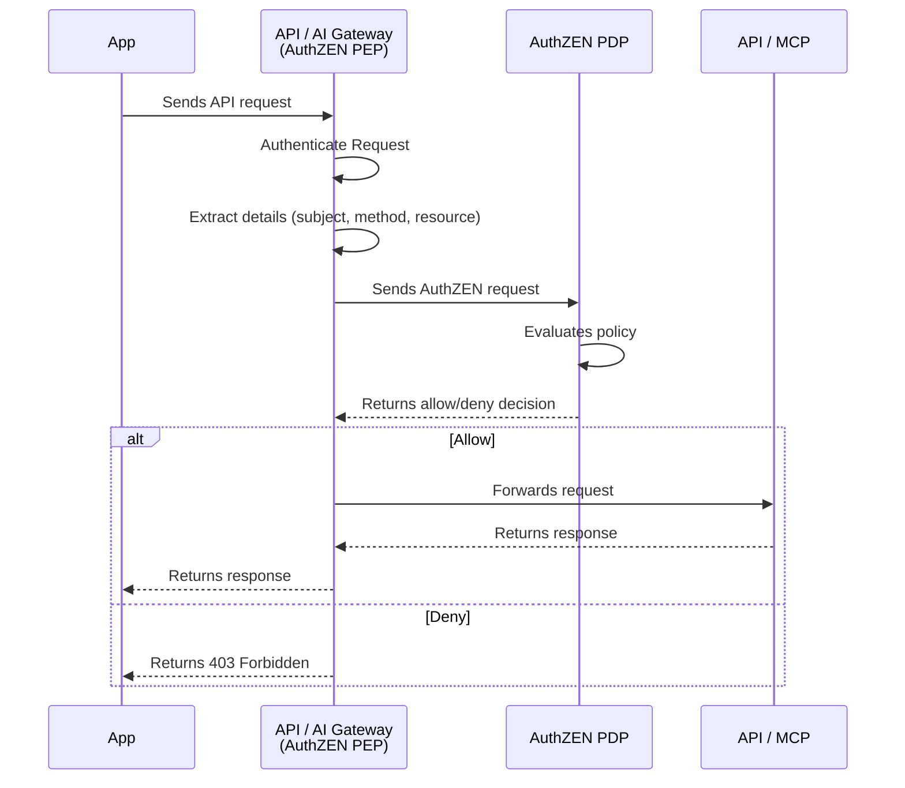

# APISIX AuthZEN Plugin

An [Apache APISIX](https://apisix.apache.org/) plugin that implements the [AuthZEN](https://openid.net/specs/openid-authzen-authorization-api-1_0-ID1.html) authorization API standard, enabling standardized policy-based access control through any AuthZEN-compliant Policy Decision Point (PDP).

> [!CAUTION]
> **Beta Software Notice: This software is currently in beta and is provided AS IS without any warranties.**
>
> - Not recommended for production use
> - Issues and feedback should be reported via the GitHub issue tracker
> - Maintenance and response times are best-effort
>
> By using this beta software, you acknowledge and accept these conditions.

## Overview

### Main Features

This development transforms Apache APISIX into an **AuthZEN-compliant PEP**, externalizing authorization decisions to any AuthZEN-compatible PDP. This approach:

- **Secures AI/MCP tool calls** - Authorize Model Context Protocol (MCP) requests with fine-grained access control
- **Centralizes decision-making** - Easier to manage and update policies across all applications
- **Decouples authorization from code** - Improves security, flexibility, and maintainability
- **Enables scalability** - Consistent enforcement across all protected resources


| Category | Feature | Description |
|--------|--------|-------------|
| **Core** | Standardized AuthZEN Enforcement | Acts as an AuthZEN-compliant **Policy Enforcement Point (PEP)** for APIs and MCP requests, delegating authorization decisions to external Policy Decision Points (PDPs). |
| **OAuth / JWT Security** | JWT-Based Subject Identification | Extracts the subject identity dynamically from JWT claims (e.g., `sub`, `preferred_username`) and maps it to the AuthZEN `subject.id`. |
|  | Dynamic JWT Context Extraction | Maps arbitrary JWT claims into AuthZEN `subject.properties` (e.g., roles, tenant, email) for attribute-based and relationship-based authorization. |
|  | OIDC/OAuth Integration | Designed to work alongside the APISIX OIDC plugin, assuming tokens are validated upstream before authorization. |
| **API Security** | Dynamic Resource Mapping | Builds AuthZEN resource identifiers dynamically from request URI, static values, or other supported sources. |
|  | HTTP Method–Based Actions | Maps HTTP methods (`GET`, `POST`, etc.) or static values into AuthZEN `action.name`. |
| **AI / MCP Security** | MCP-Aware Policy Enforcement | Understands MCP JSON-RPC requests and enforces authorization specifically on MCP workflows rather than treating them as generic HTTP calls. |
|  | Selective MCP Enforcement | Configures which MCP methods trigger authorization (e.g., `tools/call`), while allowing others (`initialize`, `tools/list`) to pass through. |
|  | Dynamic MCP Context Extraction | Extracts MCP-specific context (tool names, arguments, and parameters) and maps it directly into AuthZEN resource and action fields. |
|  | Tool-Level Authorization | Enables per-tool authorization by mapping MCP tool names (`params.name`) to AuthZEN resources. |
|  | Argument-Driven Actions | Allows MCP tool arguments (e.g., `action=delete`) to dynamically define the AuthZEN `action.name`. |


### Tested PDP Backends

- **OpenFGA** - Relationship-based access control (ReBAC)
- **Cerbos** - Policy-based access control (PBAC)

Should be compatible with **Any AuthZEN-compliant PDP**.

### Why AuthZEN?

Access control failures are the #1 security risk in the [OWASP Top 10 (2021)](https://owasp.org/Top10/A01_2021-Broken_Access_Control/). Traditional authorization approaches suffer from:

- **Lack of Interoperability** - Custom implementations lead to high maintenance costs
- **Authorization Complexity** - Traditional models are hard to scale
- **Tight Coupling** - Authorization logic embedded in application code reduces flexibility

The [OpenID Foundation AuthZEN Working Group](https://openid.net/wg/authzen/) addresses these challenges by standardizing authorization interactions based on the **P\*P architecture** principles, enabling interoperability between Policy Enforcement Points (PEP) and Policy Decision Points (PDP).


## Architecture

### Components Overview

```
                          ┌────────────────────────────────────────────────────────────┐
                          │                      Authorization                         │
                          │    ┌─────────────────┐                                     │
                          │    │   AuthZEN PDP   │                                     │
                          │    │                 │                                     │ 
                          │    └─────┬───────────┘                                     │    
                          │          │                                                 │
                       evaluation()  │  result { decision: true/false }                │
                          │          │                                                 │
                          │          │                                                 │
                          │          ▼                                                 │
┌──────────┐              │    ┌─────────────────┐                    ┌───────────┐    │
│          │   Request    │    │                 │     Request        │           │    │
│   Apps   │ ──────────────►   │  API/AI Gateway │ ─────────────────► │  API/MCP  │    │
│          │              │    │  (AuthZEN PEP)  │                    │           │    │
└──────────┘              │    └─────────────────┘                    └───────────┘    │
                          │         APISIX                                             │
                          └────────────────────────────────────────────────────────────┘
```

**AuthZEN Request (PEP → PDP):**
```json
{
  "subject":  { "type": "...", "id": "..." , "properties" :  {} },
  "resource": { "type": "...", "id": "...", "properties" :  {} } ,
  "action":   { "name": "..." },
  "context" : { }
}
```

**AuthZEN Response (PDP → PEP):**
```json
{
  "decision": true
}
```

### Sequence Diagram



## Attributes

| Name | Type | Required | Default | Description |
|------|------|----------|---------|-------------|
| **pdp** | object | Yes | | PDP configuration |
| pdp.host | string | Yes | | PDP base URL (e.g., `https://pdp.example.com`) |
| pdp.platform | string | No | `default` | Platform type: `default`, `openfga`, `cerbos` |
| pdp.model | string | No | `discover` | For OpenFGA: `discover` to auto-discover store_id, or specify store_id directly |
| pdp.api_key | string | No | | API key for PDP authentication (sent as Authorization header) |
| **http** | object | No | | HTTP client configuration |
| http.timeout | integer | No | `3000` | Request timeout in milliseconds (1-60000) |
| http.ssl_verify | boolean | No | `false` | Enable SSL certificate verification |
| http.keepalive | boolean | No | `true` | Enable HTTP keepalive connections |
| http.keepalive_timeout | integer | No | `60000` | Keepalive timeout in milliseconds |
| http.keepalive_pool | integer | No | `5` | Keepalive connection pool size |
| **subject** | object | No | | Subject configuration for AuthZEN request |
| subject.type | string | No | `identity` | Subject type in AuthZEN request |
| subject.id | string | No | `claim::sub` | Subject ID source (see [Value Extraction Syntax](#value-extraction-syntax)) |
| subject.properties | array | No | | Array of JWT claim mappings to subject properties |
| **resource** | object | No | | Resource configuration for AuthZEN request |
| resource.type | string | No | `route` | Resource type in AuthZEN request |
| resource.id | string | No | `uri` | Resource ID source (see [Value Extraction Syntax](#value-extraction-syntax)) |
| **action** | object | No | | Action configuration for AuthZEN request |
| action.name | string | No | `method` | Action name source: `method` for HTTP method (see [Value Extraction Syntax](#value-extraction-syntax)) |
| **mcp** | object | No | | MCP (Model Context Protocol) configuration |
| mcp.enforce_on | object | No | | Selective enforcement configuration |
| mcp.enforce_on.methods | array | No | `[]` | MCP JSON-RPC methods to enforce authorization on (e.g., `["tools/call"]`). If empty, all requests are enforced. |

### Subject Properties Schema

Each item in `subject.properties` array:

| Name | Type | Required | Description |
|------|------|----------|-------------|
| key | string | Yes | Property name in AuthZEN request |
| claim | string | Yes | JWT claim path (e.g., `realm_access.roles`, `tenant`) |


### Value Extraction Syntax

The `subject.id`, `resource.id`, and `action.name` fields support dynamic value extraction using the following syntax:

| Syntax | Source | Example |
|--------|--------|---------|
| `claim::<name>` | JWT claim | `claim::sub`, `claim::preferred_username` |
| `mcp::tool::name` | MCP tool name from JSON-RPC body | Tool name from `params.name` |
| `mcp::tool::arguments::<arg>` | MCP tool argument | `mcp::tool::arguments::tenant` |
| `uri` | HTTP request URI | `/api/v1/products` |
| `method` | HTTP method | `GET`, `POST` |
| (static value) | Literal string | `user`, `document`, `read` |


> **IMPORTANT:** This plugin assumes a valid JWT. You must configure the APISIX OIDC plugin with higher priority to validate the token before AuthZEN authorization is evaluated.

## AuthZEN Request Format

The plugin constructs AuthZEN-compliant requests following the specification:

```json
{
  "subject": {
    "type": "<subject_type>",
    "id": "<subject_identifier>",
    "properties": {
      "<key>": "<claim-value>"
    }
  },
  "resource": {
    "type": "<resource_type>",
    "id": "<resource_identifier>"
  },
  "action": {
    "name": "<action_name>"
  }
}
```

## AuthZEN Response Format

The plugin expects a standard AuthZEN response:

```json
{
  "decision": true
}
```

| Response | HTTP Status | Description |
|----------|-------------|-------------|
| `decision: true` | Request proceeds | Access granted |
| `decision: false` | 403 Forbidden | Access denied |
| PDP unavailable | 503 Service Unavailable | Authorization service error |
| Missing JWT claim | 401 Unauthorized | Required claim not found |


## Examples

<details>
<summary><strong>Example 1: Default Platform (Gateway Profile)</strong></summary>

Minimal configuration using defaults - ideal for standard AuthZEN PDPs:

```json
{
  "pdp": {
    "host": "https://pdp.example.com"
  }
}
```

This uses the default AuthZEN Gateway Profile:
- **Subject**: `type: "identity"`, `id: <JWT sub claim>`
- **Resource**: `type: "route"`, `id: <request URI>`
- **Action**: `name: <HTTP method>`

**AuthZEN request sent to PDP:**

```json
{
  "subject": {
    "type": "identity",
    "id": "214cc559-1bd1-4436-ab82-621f3a414b34"
  },
  "resource": {
    "type": "route",
    "id": "/api/protected"
  },
  "action": {
    "name": "GET"
  }
}
```

</details>

<details>
<summary><strong>Example 2: OpenFGA with Auto-Discovery</strong></summary>

For OpenFGA with automatic store_id discovery:

```json
{
  "pdp": {
    "host": "http://localhost:8080",
    "platform": "openfga",
    "model": "discover"
  }
}
```

The plugin will:
1. Call `GET {host}/stores` to discover available stores
2. Use the first store's ID
3. Cache the store_id for subsequent requests
4. Send requests to: `POST {host}/stores/{store_id}/access/v1/evaluation`

</details>

<details>
<summary><strong>Example 3: OpenFGA with Explicit Store ID</strong></summary>

Skip discovery by specifying the store_id directly:

```json
{
  "pdp": {
    "host": "http://localhost:8080",
    "platform": "openfga",
    "model": "01JNW1803442023HVDKV03FB3A"
  }
}
```

**Endpoint used:** `POST http://localhost:8080/stores/01JNW1803442023HVDKV03FB3A/access/v1/evaluation`

</details>

<details>
<summary><strong>Example 4: Cerbos with Subject Properties</strong></summary>

Include JWT claims as subject properties for attribute-based decisions:

```json
{
  "pdp": {
    "host": "http://localhost:3593",
    "platform": "cerbos"
  },
  "subject": {
    "type": "user",
    "id": "claim::sub",
    "properties": [
      { "key": "roles", "claim": "realm_access.roles" },
      { "key": "tenant", "claim": "tenant" },
      { "key": "email", "claim": "email" }
    ]
  },
  "resource": {
    "type": "document",
    "id": "uri"
  },
  "action": {
    "name": "method"
  }
}
```

**AuthZEN request sent to PDP:**

```json
{
  "subject": {
    "type": "user",
    "id": "214cc559-1bd1-4436-ab82-621f3a414b34",
    "properties": {
      "roles": ["admin", "user"],
      "tenant": "acme",
      "email": "admin@example.com"
    }
  },
  "resource": {
    "type": "document",
    "id": "/api/documents/123"
  },
  "action": {
    "name": "GET"
  }
}
```

</details>

<details>
<summary><strong>Example 5: With API Key and HTTP Settings</strong></summary>

For PDPs requiring authentication with custom HTTP settings:

```json
{
  "pdp": {
    "host": "https://pdp.example.com",
    "platform": "default",
    "api_key": "Bearer your-api-key-here"
  },
  "http": {
    "timeout": 5000,
    "ssl_verify": true,
    "keepalive": true,
    "keepalive_timeout": 60000,
    "keepalive_pool": 10
  }
}
```
</details>

<details>
<summary><strong>Example 6: MCP Tool Authorization</strong></summary>

Authorize AI/MCP tool calls:

**Plugin Configuration:**
```json
{
  "pdp": {
    "host": "http://localhost:8080",
  },
  "subject": {
    "type": "user",
    "id": "claim::sub"
  },
  "resource": {
    "type": "tool",
    "id": "mcp::tool::name"
  },
  "action": {
    "name": "execute"
  }
}
```

**MCP Request Body:**
```json
{
  "jsonrpc": "2.0",
  "id": 3,
  "method": "tools/call",
  "params": {
    "name": "fintech_list_expenses",
    "arguments": {
      "tenant": "tenant1"
    }
  }
}
```

**AuthZEN request sent to PDP:**
```json
{
  "subject": {
    "type": "user",
    "id": "214cc559-1bd1-4436-ab82-621f3a414b34"
  },
  "resource": {
    "type": "tool",
    "id": "fintech_list_expenses"
  },
  "action": {
    "name": "execute"
  }
}
```

</details>

<details>
<summary><strong>Example 7: MCP Selective Enforcement (Only tools/call)</strong></summary>

Enforce authorization only for `tools/call` requests, allowing other MCP methods like `initialize` and `tools/list` to pass through without authorization:

**Plugin Configuration:**
```json
{
  "pdp": {
    "host": "http://localhost:8080",
  },
  "mcp": {
    "enforce_on": {
      "methods": ["tools/call"]
    }
  },
  "subject": {
    "type": "user",
    "id": "claim::sub"
  },
  "resource": {
    "type": "mcp",
    "id": "bank"
  },
  "action": {
    "name": "mcp::tool::name"
  }
}
```

**Behavior:**

| MCP Method | Authorization |
|------------|---------------|
| `tools/call` | Enforced |
| `initialize` | Skipped (allowed) |
| `tools/list` | Skipped (allowed) |
| `resources/list` | Skipped (allowed) |

**MCP Request (tools/call - enforced):**
```json
{
  "jsonrpc": "2.0",
  "id": 3,
  "method": "tools/call",
  "params": {
    "name": "fintech_list_expenses",
    "arguments": { "tenant": "tenant1" }
  }
}
```
→ Authorization check performed, AuthZEN request sent to PDP

**MCP Request (initialize - skipped):**
```json
{
  "jsonrpc": "2.0",
  "id": 1,
  "method": "initialize",
  "params": {
    "protocolVersion": "2024-11-05",
    "capabilities": {}
  }
}
```
→ Request passes through without authorization

**Note:** If the `mcp.enforce_on` configuration is not provided or `methods` is empty, all requests are enforced (backward compatible behavior).
</details>

## References

- [AuthZEN Specification](https://openid.net/specs/openid-authzen-authorization-api-1_0-ID1.html)
- [OpenID Foundation AuthZEN Working Group](https://openid.net/wg/authzen/)
- [OpenFGA](https://openfga.dev/)
- [Cerbos](https://cerbos.dev/)
- [Apache APISIX](https://apisix.apache.org/)

## Commercial Support

Enterprise support, SLAs, and commercial features are available via [TwoGenIdentity](https://twogenidentity.com).
Originally designed and implemented by [Martin Besozzi](https://github.com/embesozzi). Maintained under the [TwoGenIdentity](https://github.com/TwoGenIdentity) organization.

Copyright 2026 TwoGenIdentity. All Rights Reserved.
